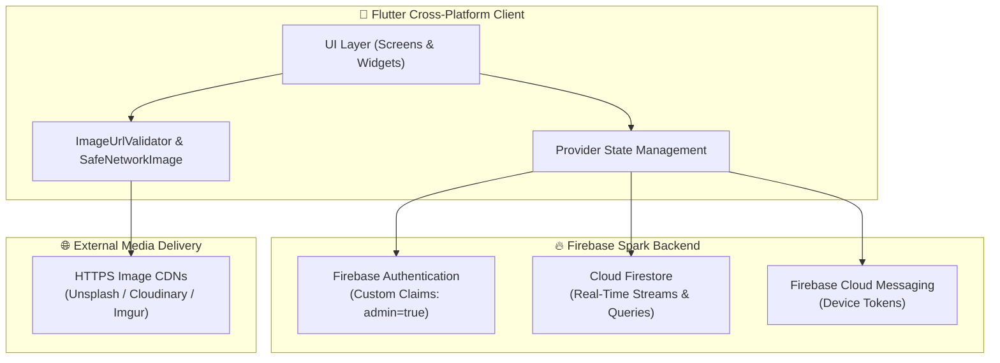

<div align="center">

  

  # 🍳 Recipe Discovery & Culinary Companion

  <p align="center">
    <b>A modern, cross-platform recipe discovery, cooking companion, and role-based management application built with Flutter & Firebase.</b>
  </p>

  <p align="center">
    <a href="https://flutter.dev"></a>
    <a href="https://dart.dev"></a>
    <a href="https://firebase.google.com"></a>
    <a href="https://github.com/SOURAVcse9/recipe-app-flutter-firebase/actions"></a>
    <a href="docs/Recipe_App_Architecture_and_Visual_Walkthrough.pdf"></a>
  </p>

  <p align="center">
    
    <a href="https://github.com/SOURAVcse9/recipe-app-flutter-firebase/releases"></a>
  </p>

</div>

---

## 📥 Production Release APK

Get the compiled Android release package ready for direct installation:

<div align="center">

  <a href="https://github.com/SOURAVcse9/recipe-app-flutter-firebase/raw/main/release/app-release.apk">
    
  </a>

</div>

<br/>

| Release Target | Binary File | File Size | Direct Download | GitHub Release |
| :--- | :--- | :--- | :--- | :--- |
| **Android (Universal)** | `app-release.apk` | `~52.3 MB` | [⬇️ **Download APK**](https://github.com/SOURAVcse9/recipe-app-flutter-firebase/raw/main/release/app-release.apk) | [📦 **v1.0.0 Asset**](https://github.com/SOURAVcse9/recipe-app-flutter-firebase/releases/tag/v1.0.0) |

> 💡 **Android Installation Note**: If prompted on your device, enable **"Install unknown apps"** in your device settings.

---

## 🌟 Overview

**Recipe App** is a production-grade Flutter mobile and web application engineered for food lovers, home cooks, and recipe publishers. It bridges the gap between engaging culinary discovery and robust content management.

Whether exploring curated categories, dynamically scaling ingredient quantities for dinner parties, utilizing the integrated step-by-step cooking timer, or curating recipes through an administrative dashboard, the app provides a responsive experience across all screen sizes.

Designed with cost-efficiency in mind, the backend operates entirely within the **Firebase Spark (Free) Plan**, utilizing Firestore real-time streams and external HTTPS media delivery without requiring cloud storage costs or server-side functions.

---

## ✨ Feature Highlights

### 🍳 Interactive Cooking & Discovery
* **Smart Search & Filter**: Real-time keyword search across titles and ingredients with category filter chips.
* **Dynamic Serving Scaler**: Multiplies fractional, decimal, and whole ingredient quantities on the fly while preserving culinary units.
* **Integrated Step Timer**: Built-in interactive countdown timers tailored to each recipe's cooking time.
* **Curated Channels**: Dynamic "Popular Recipes" based on live view counts and "Top Rated" feeds.

### 👤 Audience Personalization
* **Favorites & Collections**: One-tap bookmarking synced directly to personal user profiles.
* **Interactive Reviews**: Star ratings and user review submissions with duplicate prevention.
* **Smart Shopping List**: Direct ingredient-to-cart additions with completion checkboxes.
* **Cooking History**: Chronologically tracked recently viewed recipes.

### 🛠️ Role-Based Admin Studio
* **KPI Analytics Dashboard**: Live metrics for total recipes, published count, drafts, and active categories.
* **Dynamic Content Builders**: Multi-row ingredient and step-by-step cooking instruction builders.
* **Live HTTPS Media Preview**: Real-time URL validation and image previews powered by `SafeNetworkImage`.
* **Drafts & Publishing Flow**: Toggle recipe visibility or save in-progress drafts safely.
* **Dependency Protection**: Deletion prevention for categories containing active recipes.

### 🔐 Security & Production Auth
* **Custom Claims RBAC**: Admin privileges gated securely via Firebase Auth token claims (`admin == true`).
* **Multi-Provider Auth**: Email/password authentication and cross-platform native Google Sign-In.
* **Account Safety**: Real-time password strength analyzer and enumeration-safe password reset flows.
* **Data Isolation**: Strict user-level Firestore security rules ensuring total privacy for user documents.

---

## 🏗️ Architecture



---

## ⚡ Firebase Spark Plan Architecture

The application is architected to run on the **Firebase Spark Plan** with zero infrastructure costs:

```
                      +---------------------------------------+
                      |         Firebase Spark Tier           |
                      +---------------------------------------+
                                          |
        +---------------------------------+---------------------------------+
        |                                 |                                 |
        v                                 v                                 v
+------------------+             +------------------+             +-------------------+
|  Firebase Auth   |             |  Cloud Firestore |             |  External HTTPS   |
|  - Custom Claims |             |  - Real-Time     |             |  - Fast CDN Media |
|  - Google Sign-In|             |  - User Data     |             |  - Zero Storage   |
+------------------+             +------------------+             +-------------------+
```

* **No Cloud Storage Dependency**: Zero storage billing by utilizing verified HTTPS image URLs.
* **No Cloud Functions Dependency**: Client-driven reactive Firestore streams replace background functions.
* **Centralized URL Validation**: Strict scheme verification (`https://`), loopback prevention (`localhost`, `127.0.0.1`), and fallback error boundaries.

---

## 🔐 Security & Access Control

| Resource | Audience / Normal Users | Administrator (`admin == true`) |
| :--- | :--- | :--- |
| **Published Recipes** | Read-only (`isPublished == true`) | Full CRUD (Create, Read, Update, Delete) |
| **Draft Recipes** | ❌ Blocked | Full Access |
| **Active Categories** | Read-only (`isActive == true`) | Full CRUD |
| **User Profile & Cart** | Own UID documents only | Own UID documents only |
| **Reviews & Ratings** | Create & manage own reviews | Full visibility |
| **Admin Dashboard** | ❌ Blocked | Full Access |

---

## 🛠️ Technology Stack

| Layer | Technology | Purpose |
| :--- | :--- | :--- |
| **Framework** | [Flutter 3.22+](https://flutter.dev) | Cross-platform UI toolkit (Android, Web, Windows) |
| **Language** | [Dart 3.4+](https://dart.dev) | Strongly-typed client application language |
| **State Management** | [Provider](https://pub.dev/packages/provider) | Reactive dependency injection and state handling |
| **Authentication** | [Firebase Auth](https://firebase.google.com/docs/auth) | Identity, Google Sign-In, and Custom Claims RBAC |
| **Database** | [Cloud Firestore](https://firebase.google.com/docs/firestore) | NoSQL real-time document streams |
| **Notifications** | [Firebase Cloud Messaging](https://firebase.google.com/docs/cloud-messaging) | Multi-device push notification token synchronization |
| **Icons & Design** | [Iconsax](https://pub.dev/packages/iconsax) | Modern UI iconography |
| **Image Pipeline** | `SafeNetworkImage` & `ImageUrlValidator` | Secure external HTTPS image validation and caching |

---

## 📁 Project Structure

```text
lib/
├── firebase_options.dart      # Platform Firebase configuration
├── main.dart                  # Application entry & dynamic role routing
├── models/                    # Data models & JSON serialization
│   ├── app_preferences.dart   # User notification & theme settings
│   ├── food_category.dart     # Category entity & search indexing
│   ├── recipe.dart            # Recipe model with legacy array adapters
│   ├── review.dart            # User rating & review model
│   └── shopping_list_item.dart# Cart item model
├── providers/                 # State management layer
│   ├── auth_provider.dart     # Auth session & admin claims
│   └── recipe_provider.dart   # Real-time recipe & category streams
├── repositories/              # Firestore data access layer
├── screens/                   # User interface & navigation
│   ├── admin/                 # Admin CMS (Dashboard, Recipes, Categories)
│   ├── home_screen.dart       # Discovery feed & popular carousel
│   ├── recipe_detail_screen.dart # Interactive scaler, timer & reviews
│   └── profile_screen.dart    # User settings & admin switcher
├── utils/                     # Themes, validators & scaling logic
│   ├── app_theme.dart         # Dark / warm orange design system
│   ├── image_url_validator.dart # Strict HTTPS image URL validator
│   └── ingredient_scaler.dart # Serving multiplier engine
└── widgets/                   # Reusable UI components
    └── safe_network_image.dart# Fail-safe network image loader
```

---

## 🚀 Getting Started

Follow these steps to set up and run the project locally:

### 1. Clone the repository
```bash
git clone https://github.com/SOURAVcse9/recipe-app-flutter-firebase.git
cd recipe-app-flutter-firebase
```

### 2. Install dependencies
```bash
flutter pub get
```

### 3. Configure Firebase
Ensure your Firebase project is connected via FlutterFire CLI or replace `lib/firebase_options.dart` and `android/app/google-services.json` with your project credentials.

### 4. Run the application
```bash
# Run on connected Android device or emulator
flutter run

# Run on Web (Chrome)
flutter run -d chrome
```

### 5. Run Automated Tests
```bash
flutter test
```

---

## 📦 Building for Production

### Android Release APK
```bash
flutter build apk --release
```
The compiled binary will be generated at `build/app/outputs/flutter-apk/app-release.apk`.

### Web Build
```bash
flutter build web --no-tree-shake-icons
```
The production web bundle will be generated in `build/web/`.

---

## 📄 License

This project is licensed under the **MIT License** - see the [LICENSE](LICENSE) file for details.
