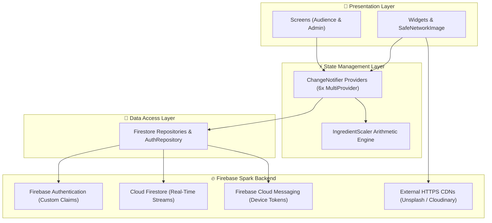

<div align="center">

# 🍳 Flutter & Firebase Recipe App
**A Cloud-Synced, Production-Grade Recipe Discovery & Meal Planning Platform**

<!-- Primary Action & Metric Badges -->
<p align="center">
  <a href="https://github.com/SOURAVcse9/recipe-app-flutter-firebase/raw/main/release/app-release.apk">
    
  </a>
  <a href="https://github.com/SOURAVcse9/recipe-app-flutter-firebase/releases">
    
  </a>
  <a href="https://github.com/SOURAVcse9/recipe-app-flutter-firebase">
    
  </a>
</p>

<!-- Tech Stack & Build Badges -->
<p align="center">
  <a href="https://flutter.dev"></a>
  <a href="https://dart.dev"></a>
  <a href="https://firebase.google.com"></a>
  <a href="https://pub.dev/packages/provider"></a>
  <a href="test/"></a>
  <a href="LICENSE"></a>
</p>

<br/>

> **Modern, reactive cross-platform mobile application powered by Flutter and Firebase. Engineered with a strict 3-tier clean architecture, dynamic serving scaler, atomic multi-user reviews, role-based access control, and 100% Firebase Spark Plan (Free Tier) compliance.**

[📥 Download APK](#-instant-apk-download--installation) • [Explore Features](#-key-highlights-at-a-glance) • [Architecture](#-architecture) • [Quick Start](#-quick-start) • [Security & RBAC](#-security--access-control) • [Tech Stack](#-technology-stack)

---

</div>

## 📥 Instant APK Download & Installation

You can download and install the pre-built production release APK on any Android phone (Android 7.0+):

| Option | Download Link | Description |
| :--- | :--- | :--- |
| **Direct APK File** | [⬇️ Download `app-release.apk`](https://github.com/SOURAVcse9/recipe-app-flutter-firebase/raw/main/release/app-release.apk) | Direct raw download from this repository |
| **GitHub Releases** | [🏷️ View GitHub Releases](https://github.com/SOURAVcse9/recipe-app-flutter-firebase/releases) | Tagged releases with changelogs and asset counts |

<details>
<summary><b>📱 How to Install on Android</b></summary>
<br/>

1. Tap the download link above on your Android phone or transfer the `.apk` via USB.
2. Open the downloaded file from your **Downloads** folder or notification bar.
3. If prompted with *"Install unknown apps"*, tap **Settings** and enable permission for your browser or file manager.
4. Tap **Install** and launch the **Recipe App**!

</details>

---

## ✨ Key Highlights at a Glance

<table>
  <tr>
    <td width="50%">
      <h3>👤 For Culinary Audiences</h3>
      <ul>
        <li><b>Dynamic Servings Scaler:</b> Real-time portion multiplier recalculating fractional & decimal ingredients.</li>
        <li><b>Smart Grocery Checklist:</b> One-tap ingredient batch addition with toggle completion.</li>
        <li><b>Atomic Review & Rating:</b> Multi-user rolling average computation with zero race conditions.</li>
        <li><b>Interactive Cooking Timer:</b> Built-in step timer with pause/resume countdown.</li>
        <li><b>Offline-First Preferences:</b> Dual-sync caching with SharedPreferences & Firestore.</li>
      </ul>
    </td>
    <td width="50%">
      <h3>🛠️ For Content Admins</h3>
      <ul>
        <li><b>Role-Based Studio:</b> Custom Claims gatekeeper (<code>token.admin == true</code>).</li>
        <li><b>Zero-Storage Media Delivery:</b> High-speed validated HTTPS image engine with fail-safe caching.</li>
        <li><b>Full Content CRUD:</b> Create, update, toggle publishing visibility, and manage taxonomy.</li>
        <li><b>Live Metric Analytics:</b> Real-time counters for active recipes, drafts, and categories.</li>
        <li><b>Instant Sync:</b> Cloud Firestore reactive streams updating all connected clients.</li>
      </ul>
    </td>
  </tr>
</table>

---

## 🏗️ Architecture

The application strictly follows a **3-Tier Clean Layered Architecture** with unidirectional reactive data flow:


```mermaid
graph TD
    subgraph UI ["📱 Presentation Layer"]
        Screens["Screens (Audience & Admin)"]
        Widgets["Widgets & SafeNetworkImage"]
    end

    subgraph State ["⚡ State Management Layer"]
        Prov["ChangeNotifier Providers (6x MultiProvider)"]
        Scaler["IngredientScaler Arithmetic Engine"]
    end

    subgraph Data ["💾 Data Access Layer"]
        Repos["Firestore Repositories & AuthRepository"]
    end

    subgraph Cloud ["🔥 Firebase Spark Backend"]
        Auth["Firebase Authentication (Custom Claims)"]
        Firestore["Cloud Firestore (Real-Time Streams)"]
        FCM["Firebase Cloud Messaging (Device Tokens)"]
        CDN["External HTTPS CDNs (Unsplash / Cloudinary)"]
    end

    Screens --> Prov
    Widgets --> Prov
    Prov --> Scaler
    Prov --> Repos
    Repos --> Auth
    Repos --> Firestore
    Repos --> FCM
    Widgets --> CDN
```

<details>
<summary><b>🔍 Click to view Data Flow & State Management details</b></summary>
<br/>

1. **Reactive Subscriptions:** Repositories listen to Firestore snapshot streams (`watchPublishedRecipes()`, `watchActiveCategories()`).
2. **State Updates:** Providers process strongly-typed Dart models and invoke `notifyListeners()`.
3. **Targeted Rebuilds:** Widgets selectively repaint using `context.watch<T>()` or `Consumer<T>`, while event handlers use non-subscribing `context.read<T>()`.
4. **Optimistic Local Updates:** Bookmarks and cart toggles reflect immediately in the UI while syncing asynchronously in the background.

</details>

---

## ⚡ Firebase Spark Tier Optimization

This project is specifically engineered to run on the **Firebase Spark Plan (Free Tier)** with **zero cloud cost**:

| Metric / Service | Traditional Architecture | This Application |
| :--- | :--- | :--- |
| **Media Storage** | Paid Firebase Storage bucket | **Validated HTTPS URLs** with client-side caching & fallback boundaries |
| **Backend Compute** | Cloud Functions for calculations | **Client-side Atomic Transactions** (`runTransaction`) & Scaler engine |
| **Database Access** | Polling queries | **Reactive Snapshot Streams** with local Firestore cache |

---

## 🔐 Security & Access Control

Role-Based Access Control (RBAC) is enforced cryptographically at the Cloud Firestore rules level:

| Resource Path | Audience / General Users | Administrator (`token.admin == true`) |
| :--- | :--- | :--- |
| `/recipes/{id}` | Read published only (`isPublished == true`) | Full CRUD (Create, Read, Update, Delete) |
| `/categories/{id}` | Read active only (`isActive == true`) | Full CRUD |
| `/users/{uid}/**` | Strict UID isolation (`request.auth.uid == uid`) | Strict UID isolation |
| `/recipes/{id}/reviews` | Public read; Authors can manage own reviews | Full visibility & moderation |
| `Admin Dashboard` | ❌ Blocked | ✅ Full Access |

---

## 🚀 Quick Start

Get the application running on your local machine in 4 easy steps:

```bash
# 1. Clone the repository
git clone https://github.com/SOURAVcse9/recipe-app-flutter-firebase.git
cd recipe-app-flutter-firebase

# 2. Install Flutter packages
flutter pub get

# 3. Run automated tests to verify environment
flutter test

# 4. Launch the app on connected device / emulator
flutter run
```

<details>
<summary><b>📦 Production Build Commands</b></summary>
<br/>

```bash
# Build Android Release APK
flutter build apk --release

# Build Web Bundle
flutter build web --no-tree-shake-icons

# Run Code Analyzer
flutter analyze
```

</details>

---

## 🗂️ Project Directory Structure

```text
lib/
├── firebase_options.dart          # Auto-generated Firebase platform configs
├── main.dart                      # App entry point & MultiProvider registration
├── models/                        # Strongly-typed data models (Recipe, Review, etc.)
├── providers/                     # Reactive ChangeNotifier state managers
├── repositories/                  # Firestore CRUD, transactions & Auth wrappers
├── screens/                       # Presentation screens
│   ├── admin/                     # Admin CMS dashboard & management forms
│   └── audience/                  # Discovery, search, details, cart & profile screens
├── services/                      # FCM push notifications (NotificationService)
├── utils/                         # IngredientScaler, ImageUrlValidator & AppTheme
└── widgets/                       # Reusable UI widgets (SafeNetworkImage, RecipeCard)
```

---

## 🧪 Quality Assurance & Test Suite

The codebase is backed by **54 comprehensive automated tests** across 9 test suites:

- `test/ingredient_scaler_test.dart` — Fractional arithmetic, unit preservation, and multiplier logic.
- `test/image_url_validator_test.dart` — Strict HTTPS validation, loopback blocking, and CDN verification.
- `test/recipe_data_validation_test.dart` — Model deserialization with legacy array backward compatibility.
- `test/recipe_provider_test.dart` — Category filtering, search query handling, and favorite state toggles.
- `test/phase2_test.dart` — Shopping list batch inserts, completion toggles, and view history.
- `test/phase3_test.dart` — Atomic rolling average calculation and review transactions.
- `test/phase4_admin_test.dart` — Admin custom claims verification and publication visibility toggles.
- `test/profile_navigation_test.dart` — Screen routing and widget tree navigation.
- `test/widget_test.dart` — Component smoke tests and error boundary assertions.

---

## 🛠️ Technology Stack

| Component | Technology | Version / Specification |
| :--- | :--- | :--- |
| **Framework** | [Flutter](https://flutter.dev) | `^3.22.0` (Dart `^3.4.0`) |
| **State Management** | [Provider](https://pub.dev/packages/provider) | `^6.1.5` |
| **Backend & Identity** | [Firebase Auth](https://firebase.google.com/docs/auth) | `^5.4.11` (Custom Claims + Google Sign-In) |
| **Cloud Database** | [Cloud Firestore](https://firebase.google.com/docs/firestore) | `^5.6.12` (Real-Time Streams) |
| **Push Notifications** | [Firebase Cloud Messaging](https://firebase.google.com/docs/cloud-messaging) | `^15.2.10` |
| **Local Persistence** | [SharedPreferences](https://pub.dev/packages/shared_preferences) | `^2.3.2` |
| **UI Design System** | [Iconsax](https://pub.dev/packages/iconsax) & Material 3 | Coral Orange `#FF5A36` Accent |

---

## 📄 License & Credits

This project is licensed under the **MIT License** — see the [LICENSE](LICENSE) file for details.

Developed with ❤️ by **[SOURAV DEBNATH](https://github.com/SOURAVcse9)** (*Student ID: 22CSE009*).
